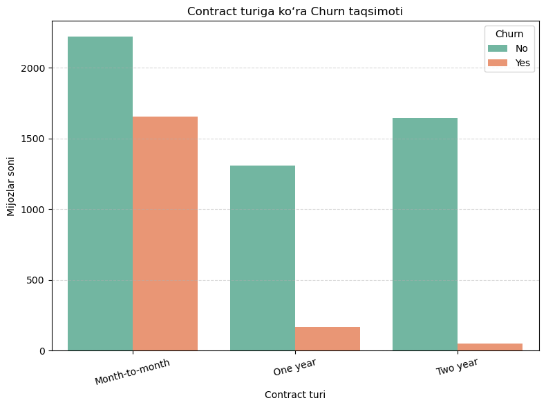
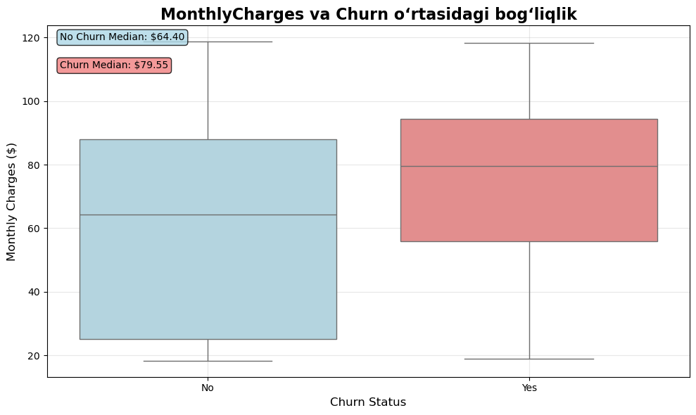
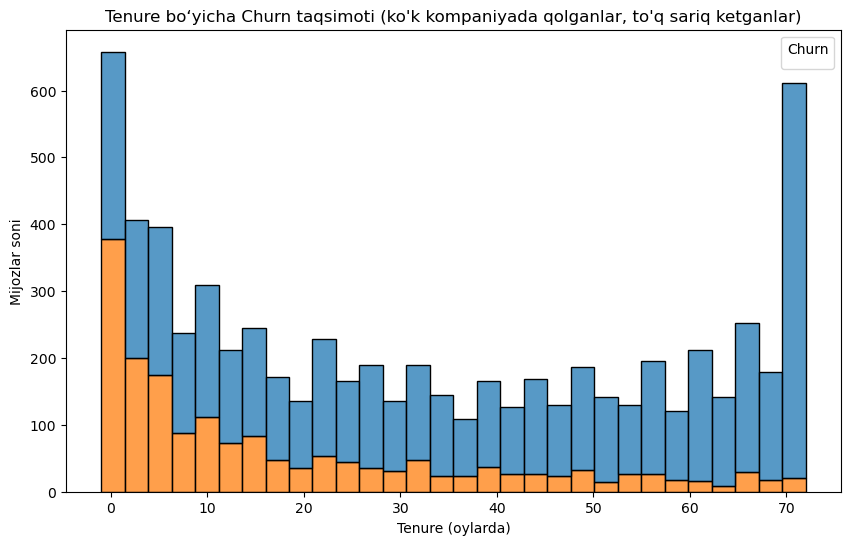
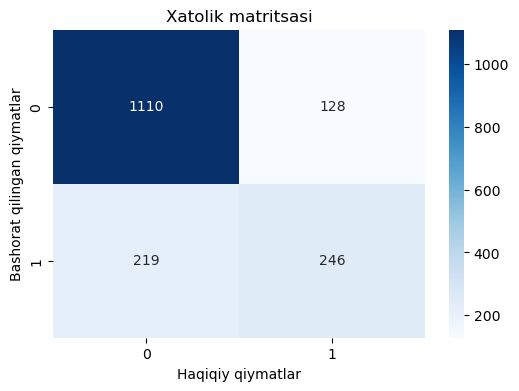
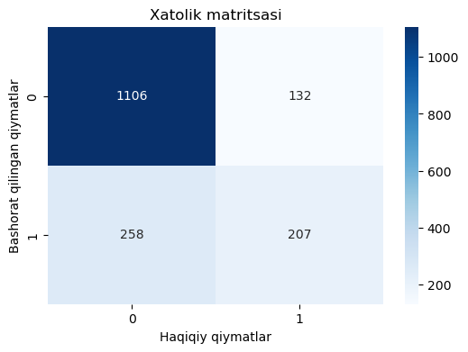
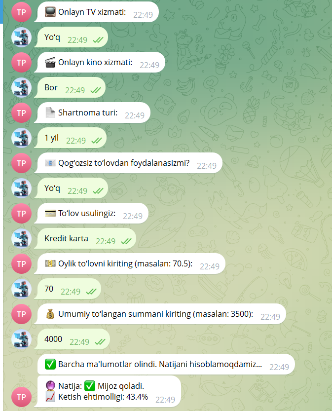

# Final Project

### (Report)
## Hypotheses and Results

When testing the hypothesis that new customers churn more, the dataset shows that a total of 378 new customers have churned.  
Its effect on the model (Logistic Regression) is -1.383536, meaning the longer the tenure, the lower the likelihood of leaving; a 2‑year contract helps retain customers, while a monthly contract increases the likelihood of churn.

For the hypothesis that women churn less — the model shows that this feature has a very small effect and almost does not influence decision‑making.

Regarding the hypothesis that internet service users churn more — its impact on the model is negative (-0.216336), which means customers without internet service are less likely to churn frequently.

## Visualizations

## Model Metrics

LogisticRegression model accuracy: **0.7962419260129184**  
F1 Score: **0.5864**  
ROC-AUC Score: **0.8382**

RandomForestClassifier model accuracy: **0.7709923664122137**  
F1 Score: **0.5149**  
ROC-AUC Score: **0.8382**

## System (Bot) Screenshots

### [Bot Link](https://t.me/telecom_predictor_bot)
