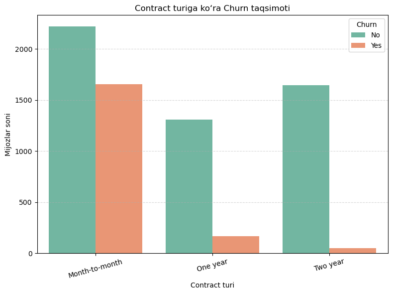
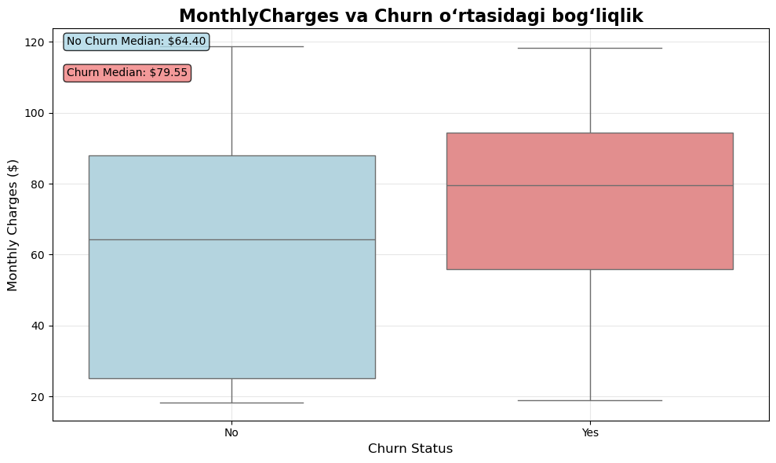
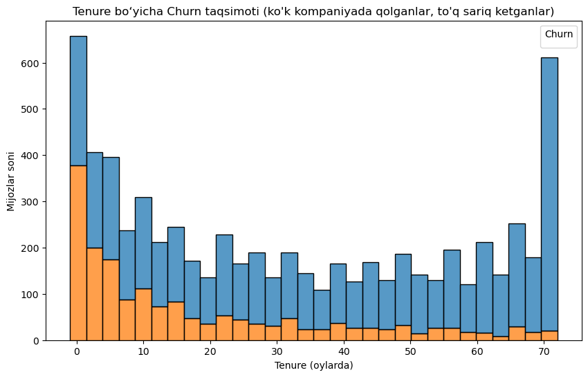
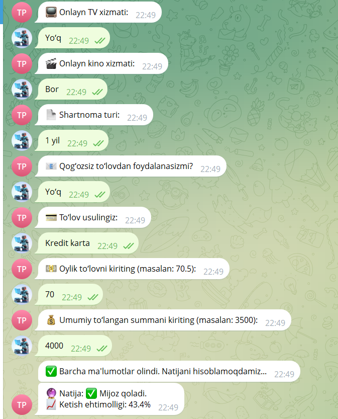

## Gipotezalar va natijalar

Yangi mijozlar ko'proq ketadimi degan gipotezani tekshirsak, datasetda jami 378 ta yangi mijoz ketgan.
Ushbu xususiyatni modelga (Logistik regressiya) ta'siri -1.383536 bo'lib, bu uzoq muddat (tenure) qancha katta bo‘lsa, ketish ehtimoli shuncha kamayadi; 2 yillik shartnoma saqlab turadi; oylik shartnoma esa ketishni oshiradi degan xulosaga olib keladi.

Ayollar kamroq ketadimi degan gipotezani qarasak - ushbu xususiyatni modellarga ta'siri juda kichkina va bu uniq qaror qabul qilishiga deyarli ta'sir o'tkazmaydi.

Internet xizmatidan foydalanuvchilar ko‘proq ketadi degan gipotezani modelga ta'siri manfiy bo'lib (-0.216336 ga teng), bu salbiy koeffitsient internetga ega bo'lmaganlar kamroq tez-tez ishlamay qolishini anglatadi.

## Grafikalar

## Model metrikalari

LogisticRegression modeli aniqligi: 0.7962419260129184   
F1 Score: 0.5864  
ROC-AUC Score: 0.8382  

RandomForestClassifier modeli aniqligi: 0.7709923664122137  
F1 Score: 0.5149  
ROC-AUC Score: 0.8382  

## Tizim (bot) skrinshotlari

### [Botga havola](https://t.me/telecom_predictor_bot)